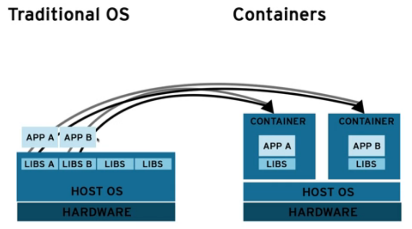
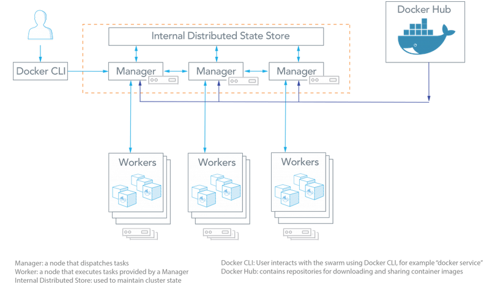
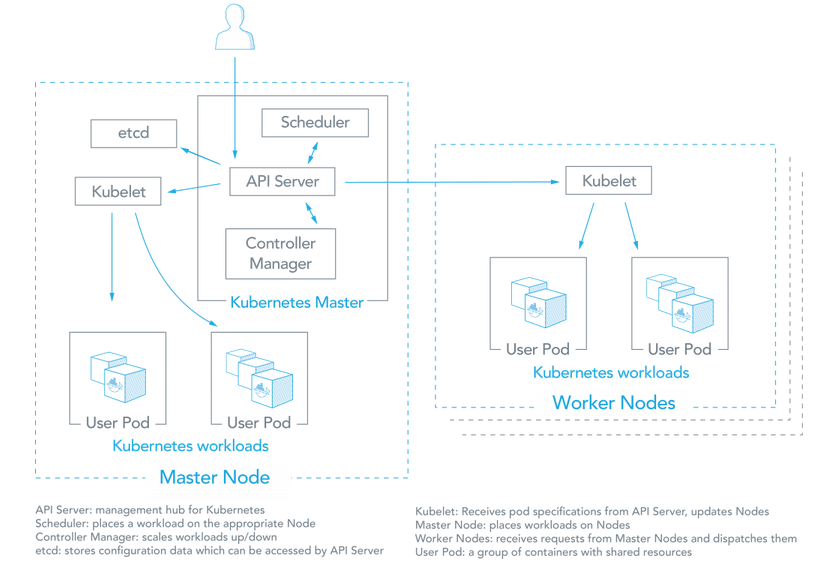

If you want to run the network on multiple hosts, you have a few options.

#### 1. You could run the nodes native on hosts. Why is this impractical?
In a typical process a few years back, administrators would spin up a virtual machine
and then they would load it up with all the libraries or applications we'd need.
We would have this kind of bloated virtual machines that would run,  application A and application B. Unfortunately that has a lot of issues with it.

1.  those machines take minutes can take hours to start up,or having to orchestrate all of these different virtual machines with each other,which is fine if you get it set up but if anything is to go wrong,that can really through a wrench into your pipeline.
2.  what if we wanted to update one of the libraries?
So if we have application A over here and application B and they're both running on this virtual machine and application B needs a new library update, well, that library is also being shared by application A.
3. Not only do you need to test application B but you'll have to go back
and test application A as well and perhaps you forget and you actually only break it to your application.

Users found that they needed to find a way that isolates these applications so that they would just have their own dependencies and they don't interfere with each other.
Not to mention instead of bloating the entire operating system from the host,
why don't we just have exactly what the applications need to run and see if we can cut down our deployment times from minutes or tens of minutes to just seconds?
So this is where containers came about.

And containers aren't actually new, but the implementations have made them a lot more user-friendly. So containers are a sort of isolated partition inside a single operating system. And they provide a lot of the benefits to the virtual machines without a lot of the overhead.

Primary benefits:
a. we have the low hardware footprint.
b. We use things like name spaces and groups to isolate these containers
and make sure the processes are isolated just the containers and they don't affect each other.
c. We have environment isolation.
d. And we also have quick deployment. So we can spin up these virtual machines in  seconds instead of minutes. e. Another great feature is that we have multiple environment deployments, so there's no more "it works in dev/sit/qa environment, but everybody should have the same experience. You can set up a development environment on a Mac, on a Linux machine, and the containers will be running independent of those hosts operating systems.
e. So this architecture is ideal for all sorts of applications but it's particularly great for microservices because a microservices architecture really thrives when
the services are isolated from each other. What you can do is deploy all these services, you have all of your containers running, these individual services and any time service, service A was to go down, it's not going to bring down your entire system. The container thrive when we're able to isolate these applications into their one separate pieces.

A quick diagram to show it pictorially.

In a traditional setting -- the host VM will have all sorts of libraries that applications need, so here we have  App A and we have  App B. Anything that happens to these libraries is going to affect both applications, not to mention this host operating system is going to be a lot more bloated. There's just a lot more things that are included that you don't ever really need for your applications.
And container takes that model get it to the bare minimum.
What is the bare minimum dependencies that we need to run these applications?
So  we've got App A in the container and we've got App B in a container,
and these just have only the libraries, at bare-minimum, that they need to run.
This is going to cause our application deployment to be just seconds, and it's completely isolated from the host operating system. So these can run anywhere.

#### 2.  Docker Swarm or Kubernetes.

Kubernetes has been deployed more widely than Docker Swarm, and is validated by Google.

_Docker Swarm_
Docker Engine v1.12.0 and later allow developers to deploy containers in Swarm mode. A Swarm cluster consists of Docker Engine deployed on multiple nodes. Manager nodes perform orchestration and cluster management. Worker nodes receive and execute tasks from the manager nodes.

A service, which can be specified declaratively, consists of tasks that can be run on Swarm nodes. Services can be replicated to run on multiple nodes. In the replicated services model, ingress load balancing and internal DNS can be used to provide highly available service endpoints. (Source: Docker Docs: Swarm mode)

Docker Swarm architecture consists of managers and workers. The user can declaratively specify the desired state of various services to run in the Swarm cluster using YAML files. Here are some common terms associated with Docker Swarm:

Node: A node is an instance of a Swarm. Nodes can be distributed on-premises or in public clouds.

Swarm: a cluster of nodes (or Docker Engines). In Swarm mode, you orchestrate services, instead of running container commands.

Manager Nodes: These nodes receive service definitions from the user, and dispatch work to worker nodes. Manager nodes can also perform the duties of worker nodes.
Worker Nodes: These nodes collect and run tasks from manager nodes.

Service: A service specifies the container image and the number of replicas.  Here is an example of a service command which will be scheduled on 2 available nodes:

`docker service create --replicas 2 --name mynginx nginx`

Task: A task is an atomic unit of a Service scheduled on a worker node. In the example above, two tasks would be scheduled by a master node on two worker nodes (assuming they are not scheduled on the Master itself). The two tasks will run independently of each other.

_Kubernetes_ Kubernetes is an open-source system for automating deployment, scaling, and management of containerized applications. https://kubernetes.io/
Three of the things that Kubernetes takes care of: orchestration, scheduling, and isolation.  

Orchestration: that refers to how do we get those containers to talk to each other.
So say we have a container over here that's running our frontend application,
let's say it's a store, and then over here we have another container that's MySQL database. So one of the things we've talked about is that containers are meant to be a little transient, meaning things like their IP address is constantly changing.
So how do we connect these two containers?
What happens if the MySQL container goes down and we spin up another one,
we'll now we have a container that's a completely different IP address,
how do these connect to each other. Kubernetes resolve this issues with services.

scheduling: So say we have five containers over here of mysql and two of them fail,
Kubernetes can automatically build up a couple more containers to just maintain that number five.
And we can also do interesting things like scaling them based on loads,
so say you start getting a lot of traffic to these containers,
we can start bringing up more and more, more and more to support that load.

Isolation: How do we make sure
that if we're running a system with 7000, 8000 containers that a failure of a couple of containers
is not going to affect any of the other containers that are running on that host machine
or that are running on any other machine?
So Kubernetes will help maintain the integrity of the system
by preventing a failure on one container to affect another container.

Pros of Kubernetes

Based on extensive experience running Linux containers at Google. Deployed at scale more often among organizations. Kubernetes is also backed by enterprise offerings from both Google (GKE) and RedHat (OpenShift).
Can overcome constraints of Docker and Docker API.
Autoscaling based on factors such as CPU utilization.
Largest community among container orchestration tools. Over 50,000 commits and 1200 contributors.

Does not have as much experience with production deployments at scale.
Limited to the Docker API’s capabilities.
Services can be scaled manually.
Smaller community and project. Over 3,000 commits and 160 contributors.

Cons of Kubernetes          

Do-it-yourself installation can be complex, but flexible. Deployment tools include kubeadm, kops, kargo, and others. Further details in Kubernetes Deployment Guide.
Uses a separate set of tools for management, including kubectl CLI.

Deployment is simpler and Swarm mode is included in Docker Engine.
Integrates with Docker Compose and Docker CLI – native Docker tools. Many of the Docker CLI commands will work with Swarm. Easier learning curve.

Common Features of Swarm and Kubernetes:

Open source projects. Anyone can contribute using the Go programming language.
Various storage options.
Networking features such as load balancing and DNS.
Logging and Monitoring add-ons. These external tools include Elasticsearch/Kibana (ELK), sysdig, cAdvisor, Heapster/Grafana/InfluxDB.
Logging and Monitoring for Kubernetes
Logging and Monitoring for Docker Swarm
